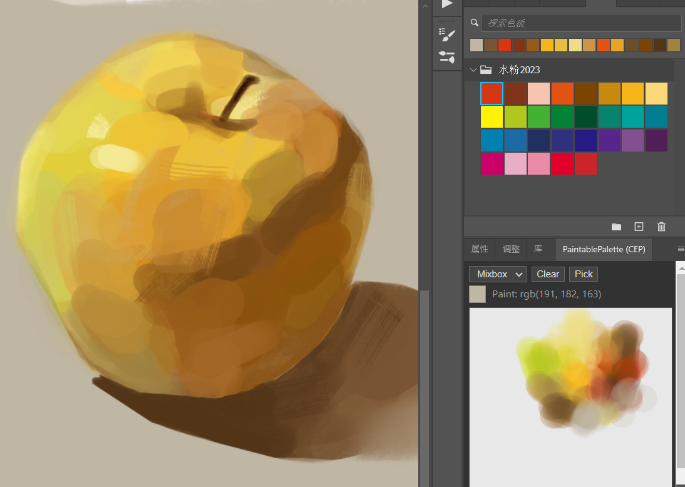
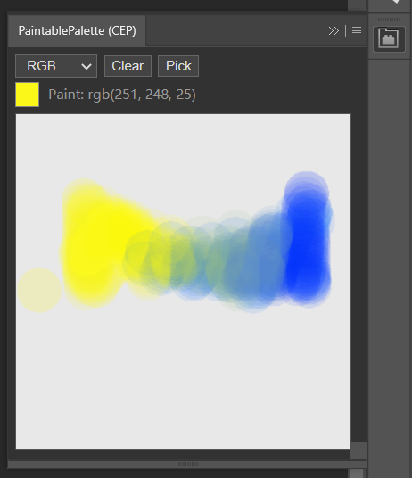
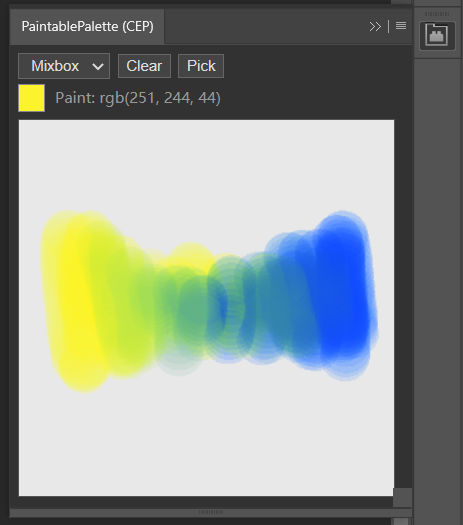

# Paintable Palette Plugin (PS)

中文说明：`README.md`

This is a “paintable palette” panel inside Photoshop: paint/mix colors on the palette using the current foreground color, and pick colors back to set Photoshop’s foreground color.



> This repository only contains the **CEP (Legacy Extension)** implementation.

## Releases (Two Versions)

GitHub Releases provides two installable zip packages:

- **RGB-only (Commercial OK)**: RGB linear blending only. Does **not** include Mixbox.

- **Mixbox-NC (Non-Commercial only)**: Includes Mixbox natural pigment mixing. Since Mixbox is licensed under **CC BY-NC 4.0**, this build is **non-commercial use only**.


> Both builds use the same extension ID (`com.jinshihui.paintablepalette`) and cannot be installed at the same time. Please choose one.

## Features

- Palette canvas (fixed 300x300)
- Paint/mix using Photoshop’s current foreground color as the brush color
- RGB-only: standard alpha-blend mixing
- Mixbox-NC: pigment-like mixing (latent space)
- Pick color: hold `Alt` and drag, or use `Pick` mode to pick from the palette and write back to Photoshop foreground color
- Clear: `Clear`
- Persistent state: restores canvas content and mode after tab switch / reload

## Compatibility

- **CEP build**: Legacy Extension (tested on Photoshop 25.x; host behavior/stability may vary by version)

## Repository Content (Source)

This repository contains the **RGB-only** source code under:

- `cep_ext/rgb_only/com.jinshihui.paintablepalette/`

Mixbox source code is not included in this repository. The Mixbox-NC build is provided only as a Release zip.

## Install & Usage (CEP)

### Option A: Install from Releases (Recommended)

1. Quit Photoshop
2. Download and unzip the corresponding Release zip
3. Copy the extracted extension folder (`com.jinshihui.paintablepalette`) into the CEP extensions directory:
   - Windows: `%APPDATA%\Adobe\CEP\extensions\com.jinshihui.paintablepalette\`
   - macOS: `~/Library/Application Support/Adobe/CEP/extensions/com.jinshihui.paintablepalette/`
4. Launch Photoshop, then open the panel via `Window > Extensions (Legacy)`

> If the extracted folder name has a suffix (e.g. `com.jinshihui.paintablepalette_RGB` / `com.jinshihui.paintablepalette_Mixbox`), rename it to `com.jinshihui.paintablepalette` before copying.

> If the extracted folder contains `mimetype` and `META-INF/signatures.xml`, keep the folder structure intact.

Example folder structure:
```text
%APPDATA%\Adobe\CEP\extensions\
└─ com.jinshihui.paintablepalette\
   ├─ mimetype
   ├─ META-INF\
   │  └─ signatures.xml
   ├─ CSXS\
   │  └─ manifest.xml
   ├─ js\
   │  ├─ main.js
   │  └─ styles.css
   ├─ jsx\
   │  └─ photoshop.jsx
   └─ index.html
```

### Option B: Install from Source (RGB-only, for development)

Copy `cep_ext/rgb_only/com.jinshihui.paintablepalette/` into the CEP extensions directory (see above).

Note: source folders typically do not include signatures. Depending on the host, you may need to enable CEP debug mode (`PlayerDebugMode=1`) to load an unsigned extension.

## Mixbox-NC Restrictions (Must Read)

The Mixbox-NC build includes Mixbox (Secret Weapons), which is licensed under **CC BY-NC 4.0 (Non-Commercial)**:

- Any build that includes Mixbox **must not be used for commercial purposes**
- For commercial licensing, please contact the Mixbox authors (upstream repo: `https://github.com/scrtwpns/mixbox`)

See `THIRD_PARTY_NOTICES.md` for more third-party notices.

